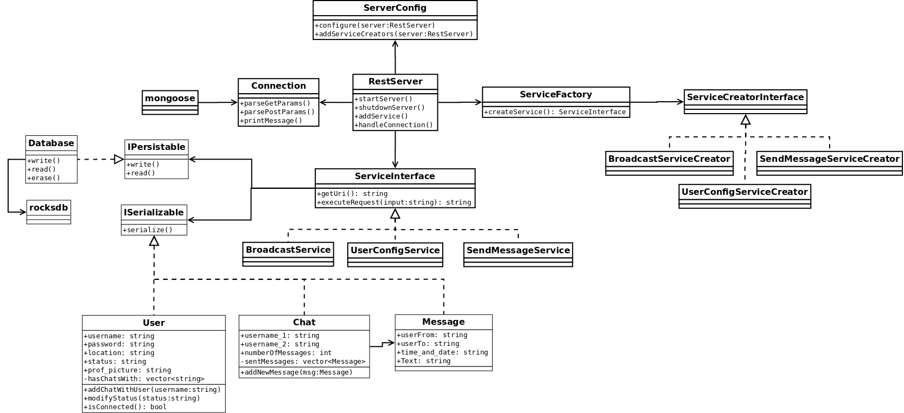
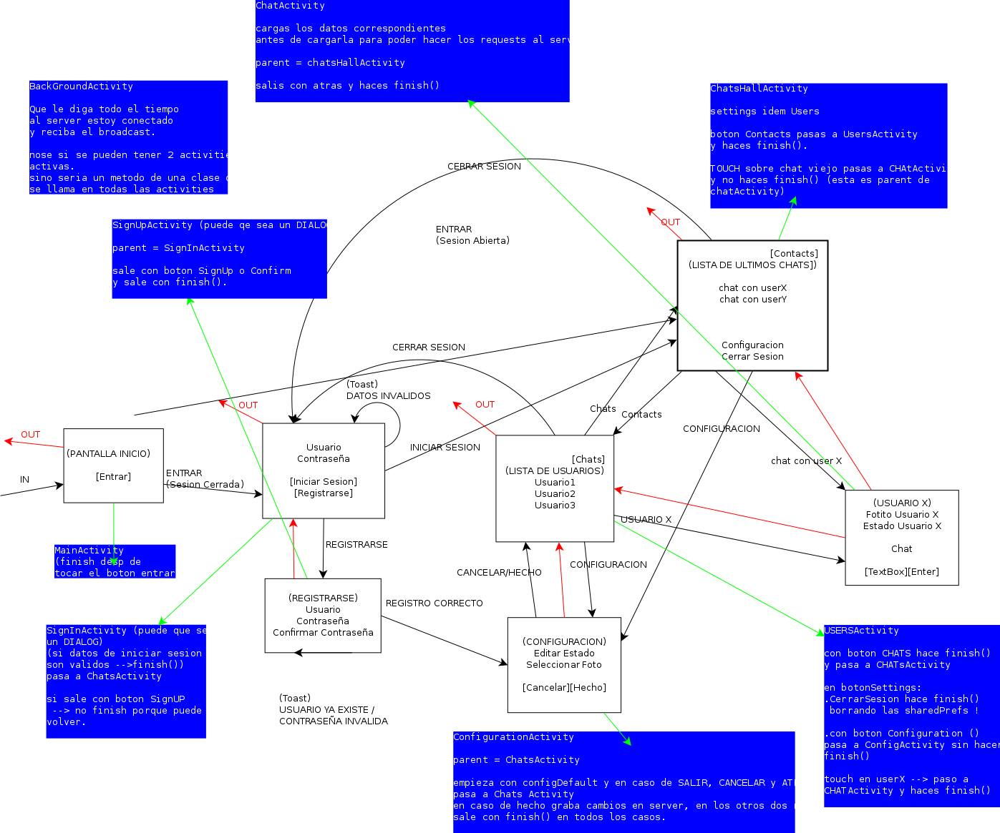

.. index:: Clases y Actividades

Clases
************

Diagrama de clases del servidor:

Para un mejor entendimiento del rol de cada clase y sus métodos ir aqui_ .
 
.. _aqui: ../../../../DoxygenHTML/Servidor/annotated.html

Actividades
************

Diagrama de actividades del cliente: 

En este diagrama se puden observar las numerosas actvidades en el cliente con las distintas relaciones presentes entre ellas. Cada actividad se puede pensar como las distintas "pantallas" con las que interactúa un usario. 

Para un mejor entendimiento del rol de cada actividad y sus métodos ir aqui_ .
 
.. _aqui: ../../../../DoxygenHTML/Servidor/annotated.html

la documentacion de las clases del servidor y de las actividades del cliente fueron generadas con **Doxygen**.
