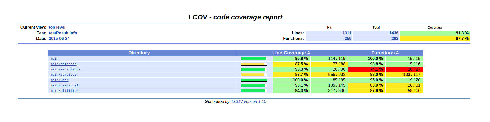

.. index:: Pruebas

Pruebas
******
Para probar las distintas clases del servidor se utilizó **cppunit** donde se realizaron pruebas unitarias para comprobar el funcionamiento correcto de cada clase cubriendo la mayor cantidad de código posible. 
Para correr las pruebas es necesario correr los siguientes comandos:

	$ cmake .

	$ make tests

	$ ./runTests.sh

Si se quieren correr con coverage será necesario instalar la dependencia **lcov** 

	$ sudo apt-get install lcov

seguida de los siguientes comandos:

	$ cmake . -Dcoverage-test=true

	$ ./coverage.sh

Esto luego abrirá una paǵina html donde se pueden observar los siguientes resultados. 

