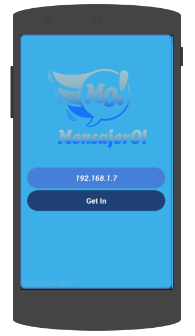

.. index:: Configuración IP

Configuración IP
****************

MensajerO! es una aplicación de mensajería para redes locales. 
Por lo tanto, antes de empezar a utilizar MensajerO!, debes ingresar el número de IP del servidor dentro de tu red.

Consultando el número de IP.
----------------------------

Ponete en contacto con el administrador del servidor de MensajerO!.
En la pantalla principal del servidor aparecerá información sobre su número de IP.

.. figure::  images/showIP.png
   :align:   center

   *Al iniciar, el servidor te indicará cual es su número de IP.*

Asignando el número de IP.
--------------------------

Conociendo el número de IP del servidor, hay que ingresarlo en la aplicación para poder empezar.

   *Ingresás el número de IP indicado, y tocás el boton 'GET IN'.*

En el caso de que pierdas la conexión con el servidor, tendrás que reingresar el número de IP.