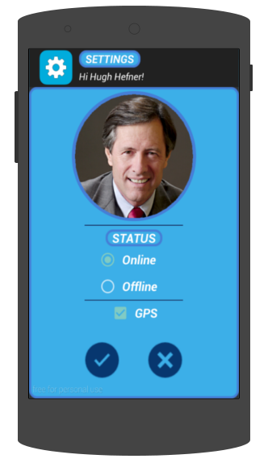

.. index:: Perfil de usuario

Perfil de usuario
*****************

Configurando tu perfil personal.
--------------------------------

Si es la primera vez que ingresás a MensajerO!, tendrás la opción de configurar tu perfil personal.

   *Acá podés configurar tu perfil.*

* La imagen es tu foto de perfil. Todos los usuarios de MensajerO! van a poder verla. Podés cambiar tu foto de perfil en cualquier momento tocando sobre la imagen y seleccionando una foto de la galería de tu celular.
* **GPS**: Activá esta opción si querés que el resto de los usuarios puedan ver en donde estás.
* **Status**: 
	* **Online**: Todos tus contactos te van a ver como conectado. Podrán mandarte mensajes privados y mensajes de difusión.
	* **Offline**: Tus contactos no podrán verte. Nadie podrá iniciar una conversación con vos, pero los usuarios que ya tengan una conversación iniciada podrán seguir mandandote mensajes. Todos podrán mandarte mensajes de difusión.

Tocá el botón |ok| para guardar tus cambios, |cancel| para descartarlos. 

Tené en cuenta que en cualquier momento vas a poder volver a esta pantalla para configurar tu perfil.
