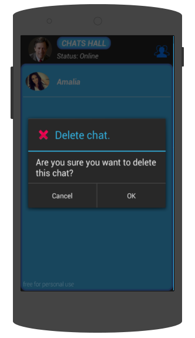

.. index:: Borrado de chats

Borrado de chats
****************

Borrando chats en MensajerO!
----------------------------

MensajerO! te da la opción de borrar chats que ya no quieras tener en tu celular.

Para eso tenés que ir al listado de chats y mantener apretado sobre el chat que quieras eliminar.

Te aparecerá un cuadro en donde tendrás que confirmar la eliminación del chat.

   *Borrando un chat viejo...*

El otro usuario con el que tuviste el chat conservará todo, y en cualquier momento cualquiera de los dos podrá reanudar la conversación.
Solamente a vos no te aparecerán los mensajes borrados. Es como volver a empezar!

Si borraste un chat por accidente y lo querés recuperar, tenés que ponerte en contacto con el administrador del servidor de MensajerO!.

Todos los mensajes que envíes y borres quedarán registrados dentro del servidor, para un posible caso de recuperación.
