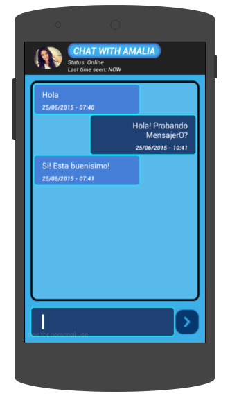
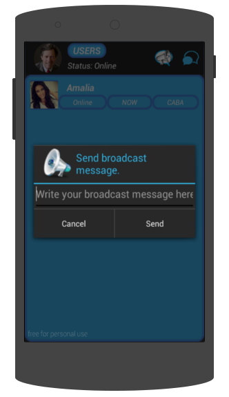

.. index:: Envío de mensajes
.. |send| image:: images/send.png

Envío de mensajes
*****************

Enviando un nuevo mensaje privado.
----------------------------------

En esta pantalla podés conversar con otro usuario de MensajerO!.

   *Conversación iniciada con el usuario Mariano!*

Además de leer los mensajes, podés ver la fecha y hora de envío de cada uno.

* Los globos del lado izquierdo son los mensajes que el otro usuario te envió.

* Los globos del lado derecho son los mensajes que vos le enviás a ese usuario.

* Para mandar un nuevo mensaje, ingresá el texto que quieras enviar en el campo inferior y tocá el botón |send|.

Tené en cuenta que esta charla solo podrán verla vos y el otro usuario, nadie más.

Enviando un nuevo mensaje de difusión.
--------------------------------------

Con MensajerO!, además de conversar con otros usuarios individualmente, podrás enviar mensajes de difusión.

Esto significa que el mensaje que envíes será recibido por todos los usuarios que estén registrados en MensajerO!.

Para enviar un mensaje de difusión, tocá el ícono |difusion| en el menú de usuarios.

   *El mensaje que envies será recibido por todos los usuarios.*

Solamente tenés que ingresar el mensaje que querés mandar, y aceptar. Qué facil!
