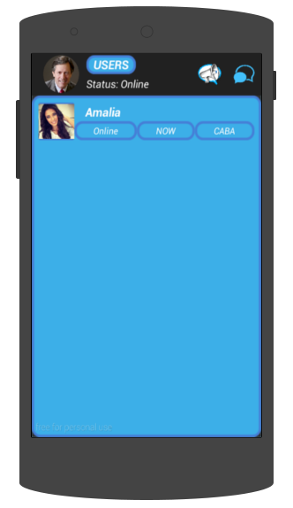

.. index:: Pantalla de usuarios
.. |chats| image:: images/mail.png
.. |overflow| image:: images/overflow.png

Pantalla de usuarios
********************

En esta pantalla, aparecerán todos los usuarios que se hayan registrado en MensajerO!.

   *Usuarios regitrados en MensajerO!*

Al tocar sobre cualquier usuario, tendrás la posibilidad de enviarle un mensaje o continuar una conversacion previamente iniciada.

El ícono |chats| te enviará a la pantalla de chats, donde podrás ver tus conversaciones iniciadas.

El ícono |overflow| abrirá un menú emergente, con las opciones:
	* **Settings:** Para modificar tu información personal.
	* **Log Out:** Para cerrar tu sesión de MensajerO!.

