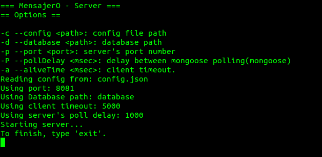

.. index:: Instalación

Instalación
***********

Instalando el servidor de MensajerO!
------------------------------------

Si todavía no tenés nuestra aplicación, te la podés bajar del siguiente link:

https://github.com/marianorodriguez/75.52-MensajerO

Una vez que hayas descargado y descomprimido el archivo, accedé con tu terminal a la carpeta donde lo hayas descomprimido y ejecutá los siguientes comandos::

	$ cd src/server
	$ ./build.sh

Es probable que la primera vez que ejecutes estos comandos, se deban instalar librerías necesarias para la correcta ejecución del servidor.

Ejecutando el servidor de MensajerO!
------------------------------------

Una vez tengas instalado el servidor de MensajerO!, podés ejecutarlo así::
	
	$ ./run.sh

   *El servidor ya está ejecutandose!.*

