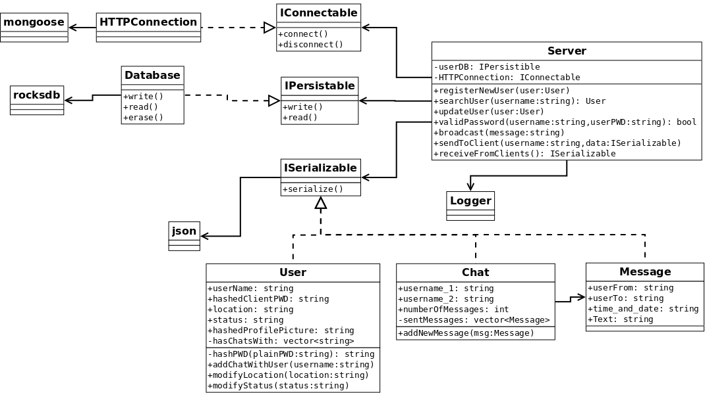

75.52 – Taller de Programación II
=================================

MensajerO
---------

Grupo 2
^^^^^^^

**Integrantes**

* Fernando Cortés
* Mariano Rodriguez
* Francisco Nery
* Matías Lafroce

**Ayudante**: Pablo Rodriguez

CHANGELOG
---------

* 2015-05-02: Versión beta
Features:
	* El servidor recibe y atiende peticiones del tipo GET y POST.
	* El servidor puede registrar usuarios y almacenarlos en una base de datos.
	* El servidor puede leer todos los usuarios registrados previamente.
	* El servidor puede responder a una petición de login validando la contraseña almacenada del usuario.
	* El servidor puede cambiar los datos de un usuario registrado.

Known bugs / TODO:
	* Falta tests de varios servicios.
	* La configuración del servidor es ignorada.
	* Llamar a un servicio inexistente no devuelve ninguna respuesta, dejando al cliente en espera
	* Bajo uso del logger.
	* Enviar un mensaje resulta en una excepción no capturada debido a que no se asignan el emisor, receptor y mensaje correctamente.

Issues:
------

Closed Issues:

server - usersService
#51 opened by marianorodriguez

server - imAliveService
#50 opened by marianorodriguez 

server - gestion de conexiones
#49 opened by marianorodriguez 

Pruebas de usuario bug 
#48 opened by mlafroce 

server, client - cambiar nombres servicios 
#43 opened by marianorodriguez 

cliente - poner config y log out en settings 
#41 opened by fernandocortes10 

server - más pruebas para DB 
#40 opened by marianorodriguez 

server - contraseñas de usuarios 
#39 opened by marianorodriguez 

server - problema con prueba de Logger
#37 opened by marianorodriguez 

client, server - definir cuales van a ser los datos a transmitir entre ambos y en que formato. 
#36 opened by fernandocortes10 

client - hacer y aceitar flujo de activities (vacias) para todos los casos de la app. 
#35 opened by fernandocortes10 

Agregar keyword 'const' y referencias faltantes. 
#34 opened by mlafroce 
 
server - estructura DataBase 
#33 opened by marianorodriguez 
 
client - serializar y deserializar json's de clases java 
#32 opened by fernandocortes10 
 
client - conectar y hacer request a URL 
#31 opened by fernandocortes10 
 
server - Cliente rest para pruebas 
#30 opened by mlafroce 

server - Servidor mongoose 
#29 opened by mlafroce 
 
server - documentar Serializables y Exceptions 
#28 opened by marianorodriguez 
 
server - pruebas de DataBase 
#27 opened by marianorodriguez 
 
server - documentar interfaz y clases de IPersistable 
#26 opened by marianorodriguez 
 
server - arreglar CMake 
#25 opened by marianorodriguez 
 
Logger no se instancia correctamente. 
#24 opened by mlafroce 
 
server - implementar clase Chat, completar sus pruebas y documentar 
#23 opened by marianorodriguez 
 
server - implementar el time&date automático en Message 
#22 opened by marianorodriguez 
 
server - agregar mas pruebas a Message! 
#21 opened by marianorodriguez 

server - add documentation to Message and ISerializable enhancement 
#20 opened by marianorodriguez 
 
server - hash User passwords enhancement 
#19 opened by marianorodriguez 
 
server - remove "deserialize" method in ISerializables enhancement 
#18 opened by marianorodriguez 
 
server - fix Message constructor bug 
#17 opened by marianorodriguez 
 
server - add more tests to the logger enhancement 
#16 opened by marianorodriguez 

Open Issues:

refactor services enhancement 
#53 opened by marianorodriguez 

server - userConfigService simple task 
#52 opened by marianorodriguez 
 
server - Configuración general enhancement 
#47 opened by mlafroce 
 
cliente - configurar que cada activity llame al servicio que corresponda simple task 
#46 opened by fernandocortes10 
 
server - pruebas de integracion bug 
#45 opened by marianorodriguez 
 
server - diagrama de clases 
#44 opened by marianorodriguez 
 
cliente - crear servidor para hacer tests simple task 
#42 opened by fernandocortes10 
 
client - implementar utilities simple task 
#38 opened by marianorodriguez 

DIAGRAMA DE CLASES:
------------------

DIVISIÓN DE TAREAS:
------------------

Luego de diseñar el diagrama de clases, se dividió al servidor en 3 partes principales:

* Serializables
* Base de Datos
* Conexión.

De los 4 integrantes, 3 se dedicaron a desarrollar cada una de estas partes del servidor, y el úlitmo se enfocó en comenzar el desarrollo de la aplicación del cliente en Android.

Luego de terminar los Serializables y la Base de Datos, todos los integrantes se enfocaron en desarrollar la parte de la conexión y comenzar a hacer los servicios requeridos.

