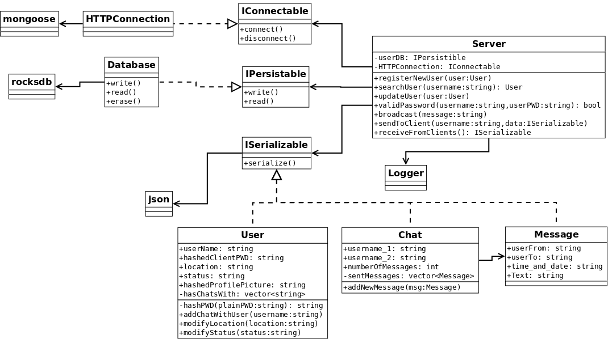

README
---------

75.52-MensajerO

Taller de Programacion II

### Documentación

Además de este Readme, se encuentra documentación en formato restructured text, en el directorio *doc/informe*.

Para compilar el documento, desde la consola dirigirse a esta carpeta y ejecutar:

	$ make html

Para luego ver el informe, abrir el archivo *doc/informe/_build/html/index.html*

La documentación fue generada con sphinx-doc.

### Compilación

Desde consola dirigirse a la carpeta del proyecto y ejecutar los siguientes comandos:

Instalar dependencias

    $ sudo apt-get install libbz2-dev zlib1g-dev libcppunit-dev libcurl4-gnutls-dev lcov

Compilar rocksdb

    $ cd src/server/3rd-party/rocksdb
    $ make static_lib

Configurar script de compilación

    Desde *src/server* correr

    $ cmake .

    Si se quiere correr pruebas de coverage, se debe correr

    $ cmake . -Dcoverage-test=true

Se compila desde src/server:

Para compilar las pruebas:

    $ make tests

Para compilar el servidor:

    $ make server

Para limpiar el proyecto:

    $ make clean

### Scripts prearmados

Para facilitar la instalación de la aplicación, se armaron algunos scripts en bash que agrupan varios de los comandos detallados abajo.

**build.sh** : Compila la aplicación en una carpeta llamada *build*, y copia en su interior a *run.sh*, *runTests.sh*, *coverage.sh*. Además, si se le agrega el parametro "coverage" compila con soporte para pruebas de cobertura.

**run.sh** : Ejecuta el servidor, y crea una carpeta para las bases de datos si es necesario.

**runTests.sh** : Ejecuta las pruebas, limpiando los contenidos creados por pruebas anteriores, 

**coverage.sh** : Ejecuta las pruebas y recolecta los datos de los tests de coverage.

**clean.sh** : Limpia los archivos generados por CMake y Makefile, dando además la opción de borrar la base de datos.

La aplicación soporta varios flags para la configuración:

* **-c**, **--config** <path/to/config.json>: dirección del archivo de configuración.
* **-p**, **--port** <numPuerto>: selecciona el puerto de escucha del servidor.
* **-d**, **--database** <path/to/db>: directorio de base de datos
* **-P**, **--pollDelay** <msec>: demora entre lecturas del socket(mongoose)
* **-a**, **--aliveTime** <msec>: tiempo que se considera que un usuario esta conectado

Para correr coverage de las pruebas

* Si el proyecto fue compilado con soporte para coverage, correr desde *src/server*

    $ tests/tests
    $ lcov -c -d main/ -o testOutput.info
    $ genhtml testOutput.info --output-directory=report

* Para reiniciar los contadores (en caso de que se quiera volver a correr las pruebas)

    $ lcov -z -d main/

FUNCIONALIDADES
---------

**SERVIDOR:**

**Funcionalidades Terminadas:**

* Servicio de autenticación/registracion: Ya se permite registrar y autenticar a los usuarios que se quieran conectar.
* Servicio para delivery de conversaciones: Ya se permite realizar el envio de mensajes de un usuario a otro.
* Almacenamiento de conversaciones: Antes de enviar un mensaje al usuario correspondiente mediante el servicio anteriormente citado, el servidor lo guarda en su base de datos. De esta forma, el usuario que reinstale la aplicación no perderá ningún mensaje.
* Servicio de consulta de usuarios disponibles: Se permite consultar el listado de usuarios conectados y disponibles actualmente.
* Log: El servidor tiene implementado el sistema de logging, aunque se lo está usando muy poco.

**Funcionalidades en Desarrollo:**

* Servicio de administración de perfil de usuario: En este momento, el cliente solo puede modificar su estado y su foto de perfil. Falta agregarle el "nombre" con el que todo el mundo lo va a ver y el checkin opcional.
* Checkin de usuarios: Mediante las coordenadas (latitud y longitud) enviadas por el cliente, el servidor tiene la capacidad de informarle el nombre del barrio en el que se encuentra. Esta funcionalidad sigue en desarrollo, falta calibrar algunas variables y hacer más pruebas, por lo que es probable que no funcione adecuadamente.

**Funcionalidades aún no implementadas:**

* Servicio de delivery de difusión: El servidor debe permitir que un usuario envíe un mensaje a todos los usuarios conectados y disponibles actualmente.

**CLIENTE:**

**Funcionalidades Terminadas:**

* Autentificación/Registracion: El cliente posee una pantalla de ingreso en donde se le pide al usuario que se identifique o registre en el servidor.

* Visualización de conversaciones: El cliente permite acceder al listado de conversaciones que el usuario tuvo con otros usuarios. Si el cliente borra una conversacion, ya no le será posible acceder a esos mensajes, aunque por seguridad, esa información no se borrará de la base de datos del servidor.

* Lista de usuarios conectados: El cliente permite visualizar un listado con los usuarios conectados, junto con su nombre, foto de perfil y estado.
* Envío de conversaciones: Al seleccionar un usuario, el cliente permitirá mandarle a este un mensaje, iniciando así una conversación.
* Configuración de perfil: El cliente permite a un usuario acceder a una pantalla para cambiar sus datos personales.

**Funcionalidades en Desarrollo:**

* Checkin: Por el momento, el usuario no puede desactivar la opción de checkin.

**Funcionalidades aún no implementadas:**

* Log: Falta implementar un sistema de logging similar al del servidor.
* Visualización de estado de usuario: Falta diseñar una pantalla donde se puedan ver en detalle los datos públicos de cualquier usuario.

CHANGELOG
---------

* 2015-05-02: Versión beta
Features:
	* El servidor recibe y atiende peticiones del tipo GET y POST.
	* El servidor puede registrar usuarios y almacenarlos en una base de datos.
	* El servidor puede leer todos los usuarios registrados previamente.
	* El servidor puede responder a una petición de login validando la contraseña almacenada del usuario.
	* El servidor puede cambiar los datos de un usuario registrado.

Known bugs / TODO:
	* Falta tests de varios servicios.
	* La configuración del servidor es ignorada.
	* Llamar a un servicio inexistente no devuelve ninguna respuesta, dejando al cliente en espera
	* Bajo uso del logger.
	
* 2015-06-04: 
Features:
	* Se agregaron las pruebas de todos los servicios actualmente disponibles.
	* Se corrigieron varios bugs que hacían que no funcionara el servidor.
	* Se agrega gran parte de la interacción servidor-cliente.

Known bugs / TODO:
	* La configuración del servidor es ignorada.
	* Se deben agregar chequeos para detectar requests maliciosos/mal hechos.
	* Bajo uso del logger.
	

DIAGRAMA DE CLASES
------------------

DIVISIÓN DE TAREAS
------------------

Luego de diseñar el diagrama de clases, se dividió al servidor en 3 partes principales. De los 4 integrantes, 3 se dedicaron a desarrollar cada una de estas partes del servidor:

* Serializables : Mariano Rodríguez
* Base de Datos : Francisco Nery
* Conexión : Matías Lafroce

Luego de terminar los Serializables y la Base de Datos, los 2 integrantes se enfocaron en desarrollar la parte de la conexión y se dedicaron a empezar los servicios requeridos con sus pruebas. 

El úlitmo integrante, Fernando Cortés, se enfocó en el desarrollo de la aplicación del cliente en Android.

